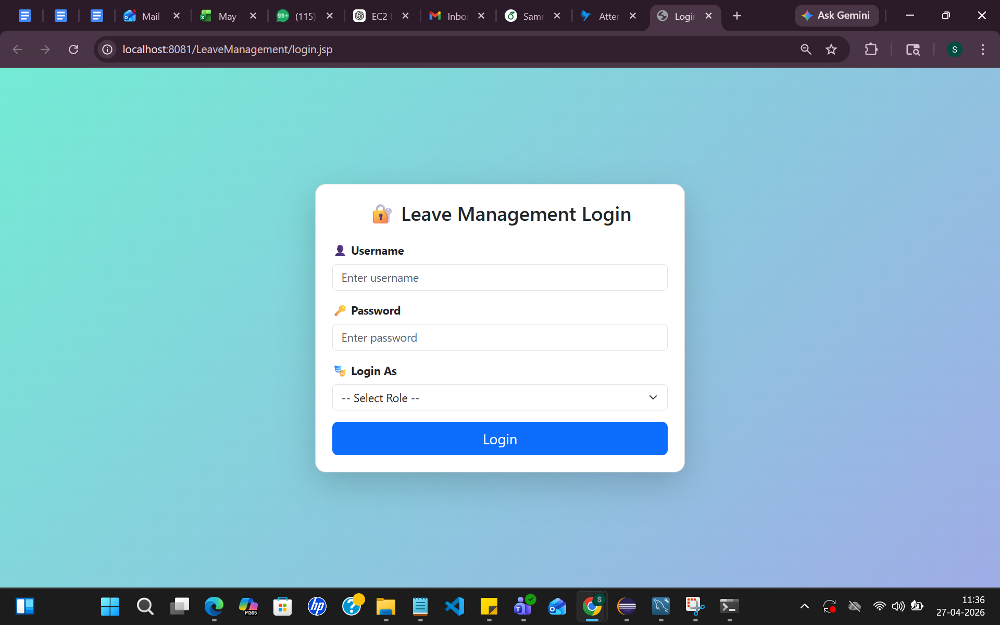
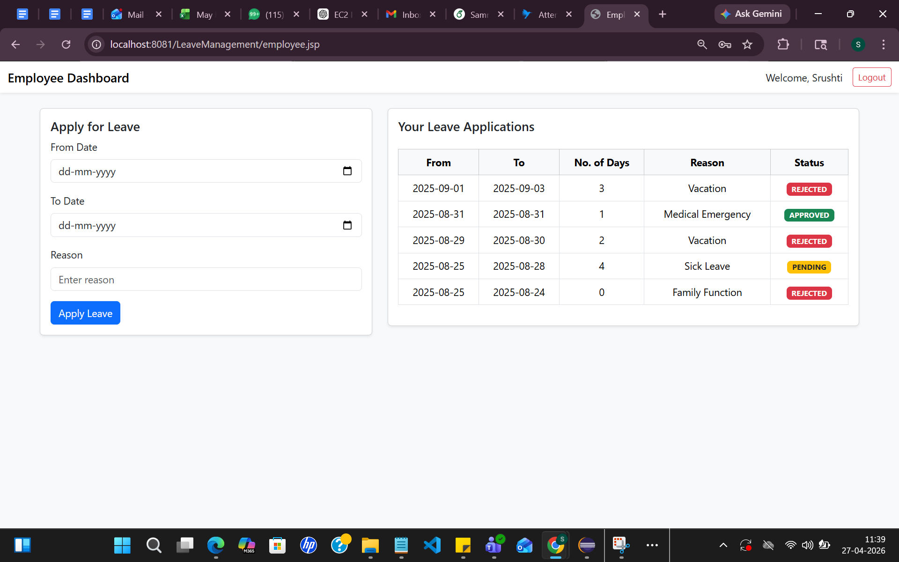
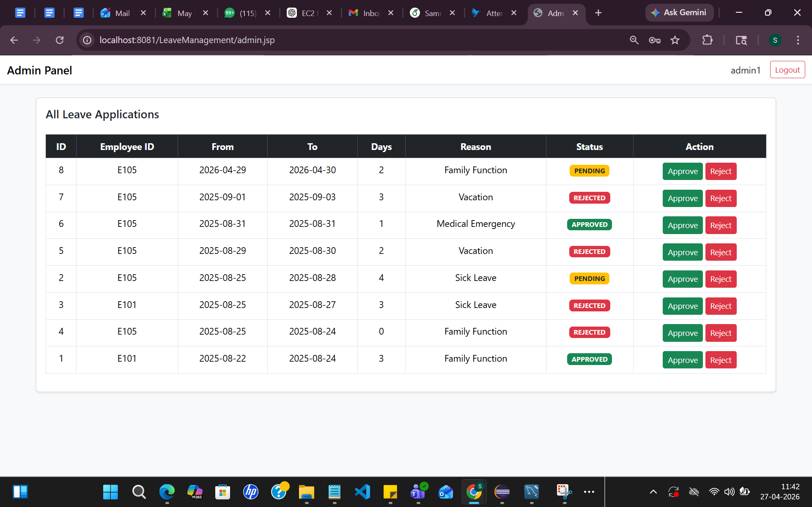
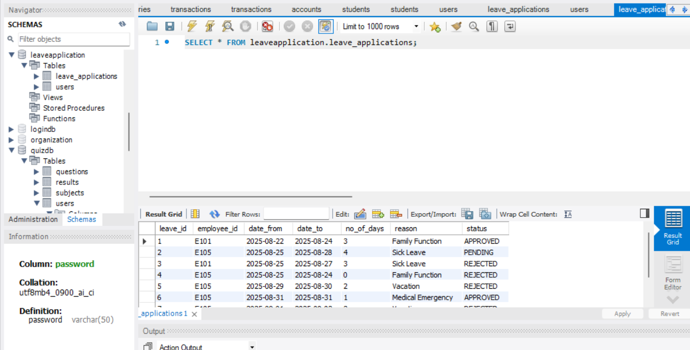
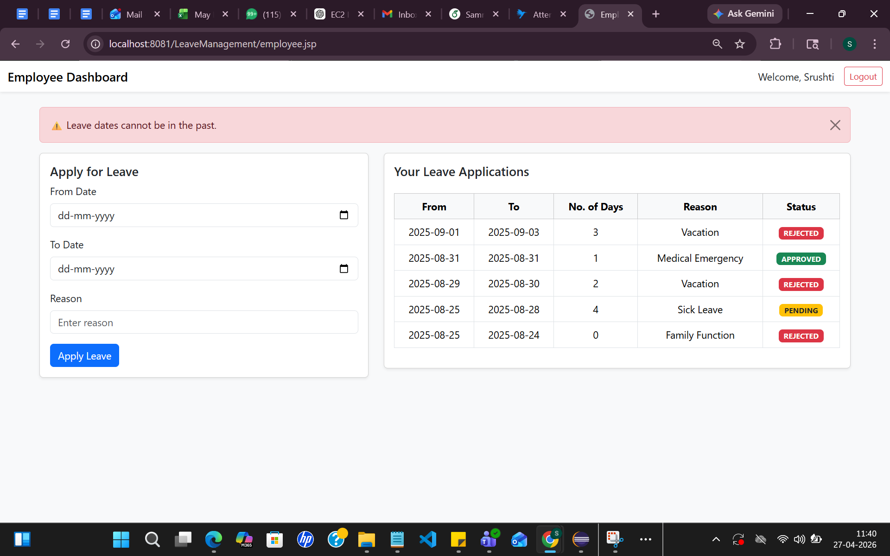

# Leave Management System (Java Servlets + JSP + JDBC + MySQL)

## Overview

This project is a role-based Leave Management System developed using Java Servlets, JSP, JDBC and MySQL following MVC layered architecture.

The system allows employees to apply for leave, view leave status and enables administrators to review and approve leave requests. It also includes validation logic to prevent invalid leave selections such as past-date submissions.

This project demonstrates backend workflow automation using Servlets, DAO pattern and database-driven approval logic.

---

## Tech Stack

Java (Core Java)

Java Servlets

JSP

JDBC

MySQL

Apache Tomcat v9

MVC Architecture

DAO Design Pattern

Layered Backend Architecture

---

## Features

Employee Login Authentication

Admin Login Authentication

Apply Leave Workflow

Admin Leave Approval System

Leave Status Tracking

Past-Date Leave Validation Logic

Session-based Authentication

DAO Layer Database Integration

Service Layer Business Logic Handling

Exception Handling with Validation Messages

---

## Project Architecture

The application follows layered MVC architecture:

Controller Layer → Servlets

Service Layer → Business Logic

DAO Layer → Database Interaction

Model Layer → Entity Classes

Database Layer → MySQL

Frontend Layer → JSP Pages

---

## Project Structure

leave-management-system-java-servlet-jdbc

src/main/java/com/aurionpro

controller
├── AdminServlet.java
├── EmployeeServlet.java
├── LeaveApplyServlet.java
├── LeaveApprovalServlet.java
├── LoginServlet.java
└── LogoutServlet.java

dao
├── LeaveDao.java
└── UserDao.java

model
├── LeaveApplication.java
└── User.java

service
├── LeaveService.java
└── UserService.java

util
└── DBConnection.java

src/main/webapp

admin.jsp
employee.jsp
login.jsp
META-INF
WEB-INF

Screenshots
├── login.jsp.png
├── employee.jsp.png
├── admin_dashboard.png
├── database_schema.png
└── exceptions_msg.png

---

## Database Configuration

Database name:

leavemanagementdb

Tables used:

users
leave_applications

Update database credentials inside:

src/main/java/com/aurionpro/util/DBConnection.java

Example connection:

jdbc:mysql://localhost:3306/leavemanagementdb

---

## How to Run the Project

Clone repository:

git clone https://github.com/Samruddhi2003github/leave-management-system-java-servlet-jdbc.git

Open project in Eclipse IDE

Start MySQL Server

Create database:

leavemanagementdb

Update DB credentials inside:

DBConnection.java

Start Apache Tomcat Server

Run application:

http://localhost:8081/LeaveManagement/login.jsp

---

## Application Screenshots

### Login Page

---

### Employee Dashboard

---

### Admin Dashboard

---

### Database Schema

---

### Validation: Past Date Leave Restriction

This validation ensures employees cannot apply leave for past dates, demonstrating business-rule enforcement at application level.

---

## Key Learning Outcomes

Implemented role-based authentication system

Designed leave request approval workflow

Built layered MVC architecture using Servlets and JSP

Implemented DAO pattern for database operations

Added business-rule validation for leave application dates

Integrated session-based authentication handling

Developed admin approval pipeline system

---

## Author

Samruddhi Bansode

AI & Data Science Engineer  
Java Backend Developer
